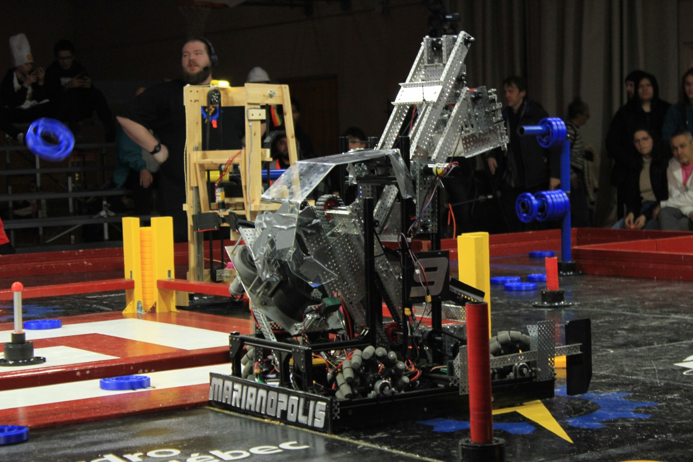

# 2025-Robot-Controls

This repository contains the C++ codebase for the Marianopolis robotics team competing in the 2025 CRC Robotics Competition. The code is designed to be uploaded via the [Arduino IDE](https://www.arduino.cc/en/software) to control our custom-built robot.


---

## 🧩 Full Robot CAD Design

You can explore the full CAD assembly of the 2025 robot on Onshape using the link below:

👉 [🔗 View Full Robot CAD on Onshape](https://cad.onshape.com/documents/a2734e4784fa8068635b3294/w/16b7b7efe2af4ba885564039/e/841d01ddace3edf723e5a0dc?renderMode=0&uiState=6875c6f51bd008323ed1c823)  

---

## 📁 Project Structure

| File | Description |
|------|-------------|
| `epsilon25.ino` | Main Arduino sketch files for robot control. `epsilon25.ino` contains key pin definitions and hardware wiring documentation. |
| `drive25.cpp`, `drive25.h` | Implements the robot drive system including high/low speed modes and joystick control. |
| `button.cpp`, `button.h` | Debounce logic and button handling for various input triggers. |
| `cu.sh`, `mon.sh` | Utility shell scripts for uploading and monitoring serial output from the Arduino. |

---

##  Key Features

### Joystick-Controlled Speed Modes
- The left joystick allows the pilot to toggle between **high-speed** and **low-speed** drive modes.
- Enhances control during precise maneuvering tasks or full-speed traversal.

### PID-Controlled Arm Lift System
- A custom-built **PID (Proportional-Integral-Derivative)** controller ensures accurate and stable vertical positioning of the robot's arm.
- Encoder feedback is used to dynamically adjust the motor output and maintain the target height with minimal overshoot or oscillation.

### Modular Code Design
- Separated into `.cpp` and `.h` files for better organization, maintainability, and code reuse.
- Input handling, drive control, and PID logic are encapsulated for clarity.

---

## Software Documentation
### CRCLib Library
- This is a library of commands that are specific to the CRCArduino supported by the official Canadian Robotics Competition.
  👉 [🔗 View the Wiki page for more info!](https://robocrc.atlassian.net/wiki/spaces/AR/overview)

---

## Hardware Documentation

### Motor Controllers
- We use **VEX Victor SPX** motor controllers for reliable motor actuation.
- We use 2 goBilda 5202 Series Yellow Jackets (which have a 6mm D-Shaft) at 30RPM and 60RPM for the main arm joints. They come with built-in quadrature encoders for PID controls. The specifications of these FTC legal motors are available [here](https://www.gobilda.com/yellow-jacket-planetary-gear-motors?srsltid=AfmBOopsTfxfbD4u5MEE4EgBx47DAuOrVyuZktkP877sHpAUvZp4fgEy).
- Detailed **pin mappings**, connection instructions, and setup notes can be found in [`epsilon25.ino`](./epsilon25.ino).

---

## 💡 Getting Started

1. **Install Arduino IDE**: [Download here](https://www.arduino.cc/en/software).
2. **Install dependencies**: This code requires the Encoder library by Paul Stoffregen. [Make sure to install it in the Arduino IDE](https://www.arduinolibraries.info/libraries/encoder)
3. **Clone this repository**:
   ```bash
   git clone https://github.com/dwei-exe/2025-Robot-Controls.git
